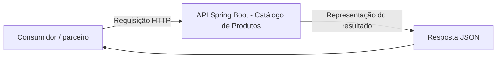
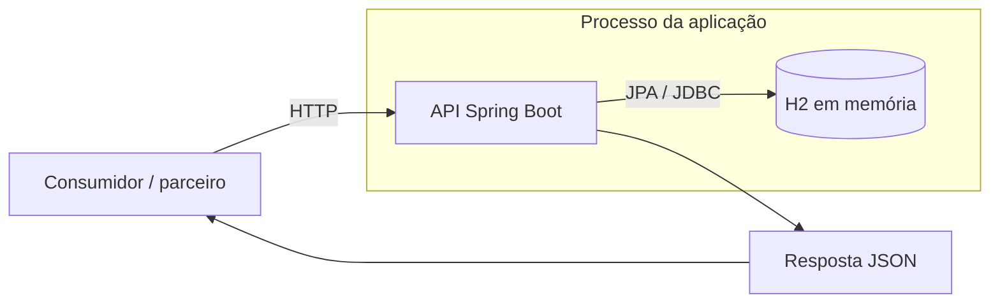
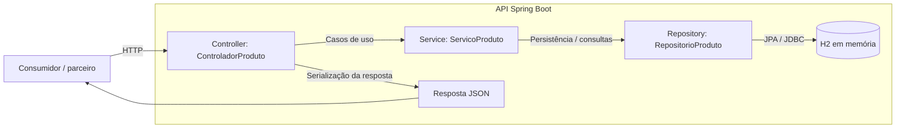
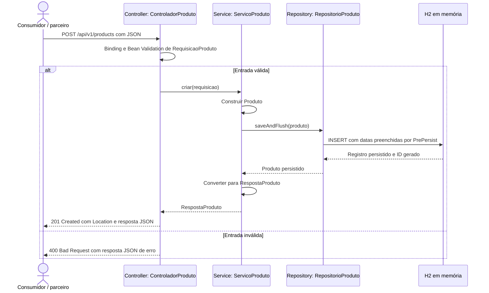

# Arquitetura do Catálogo de Produtos

[Voltar ao README](../README.md)

## 1. Introdução

Este documento descreve exclusivamente a implementação existente da API `product-catalog-api`, desenvolvida para o desafio final de Arquitetura de Software. A solução é um monólito organizado em camadas, destinado a estudo. O documento não declara prontidão para produção nem resultados de uma nova execução de testes.

As referências são o [POM](../pom.xml), a [configuração da aplicação](../src/main/resources/application.yml), a migration e as classes de produção e teste. Os exemplos de JSON no [README](../README.md) representam o contrato atual.

## 2. Contexto do problema

Uma empresa de vendas on-line precisa manter informações de produtos e disponibilizá-las por HTTP. O consumidor/parceiro dos diagramas representa um cliente hipotético da API, não uma integração implementada. A aplicação oferece operações sobre nome, descrição, preço, estoque e estado ativo, sem modelar pedidos, pagamentos ou clientes.

### Diagrama de contexto



O nó de resposta JSON representa dados, não um serviço separado. Uma exclusão bem-sucedida retorna 204 sem corpo.

## 3. Objetivos

- Disponibilizar CRUD, busca parcial por nome e contagem por uma API REST.
- Separar contrato HTTP, casos de uso e persistência.
- Validar entradas e padronizar erros.
- Demonstrar migrations e mapeamento objeto-relacional com um banco local em memória.
- Manter testes dos casos de uso, do contrato MVC e da integração com o banco.

## 4. Escopo

Inclui cadastro, listagem, consulta por ID, busca por nome, contagem, atualização completa dos campos editáveis e exclusão física. Inclui documentação OpenAPI e console H2 habilitados durante a execução.

Produtos ativos e inativos participam igualmente das consultas e da contagem. `ativo` é um dado cadastral; não existe filtro automático por esse campo. `quantidadeEstoque` é atualizado pelo PUT, sem operações específicas de reserva ou movimentação de estoque.

Não inclui autenticação, autorização, paginação, interface de gestão, banco persistente, containerização, pedidos, pagamentos, mensageria ou integrações externas.

## 5. Requisitos funcionais representados no código

| ID | Requisito | Implementação |
|---|---|---|
| RF01 | Criar produto válido | `ServicoProduto.criar` e POST com 201 e `Location` |
| RF02 | Listar todos os produtos | `listarTodos`, retornando lista inclusive vazia |
| RF03 | Consultar produto por ID | `buscarPorId`; exceção quando inexistente |
| RF04 | Buscar por parte do nome sem diferenciar maiúsculas | `buscarPorNome` e consulta JPQL com `lower` e `locate` |
| RF05 | Contar os produtos | `contar`, retornando `RespostaContagem` |
| RF06 | Atualizar campos editáveis | `atualizar`; preserva ID e criação |
| RF07 | Excluir produto | `excluir`; remoção física; 404 quando inexistente |
| RF08 | Validar dados e informar falhas | Bean Validation e `TratadorGlobalExcecoes` |
| RF09 | Fornecer contrato consultável | Metadados OpenAPI e Swagger UI |

## 6. Requisitos não funcionais e atributos observáveis

| Aspecto | Mecanismo existente | Limite |
|---|---|---|
| Organização | Pacotes por responsabilidade e injeção por construtor | Não mede facilidade de manutenção |
| Testabilidade | Mockito, MockMvc e integração com H2 | Não equivale a cobertura integral |
| Consistência das operações de escrita | Transações no service e restrições SQL | Não há testes de concorrência nem campo de versão |
| Uniformidade do contrato | DTOs e tratamento global de erros | Parte dos nomes HTTP permanece em inglês |
| Repetibilidade da compilação | Java 21, parent Spring Boot e Maven Wrapper | Primeiro uso depende de acesso aos artefatos |
| Inspeção local | SQL formatado, OpenAPI e console H2 | Não constitui monitoramento de produção |

Não existem metas implementadas ou medidas de disponibilidade, latência, capacidade, segurança ou escalabilidade.

## 7. Restrições

- Java 21 e Spring Boot 3.5.16, conforme o POM.
- Springdoc 2.8.17; Maven 3.9.9 pelo Wrapper 3.3.4.
- Aplicação única, banco H2 em memória e ausência de infraestrutura externa.
- Pacote base `br.com.rauel.productcatalog`.
- Classes e atributos próprios em português; pacotes de camadas e rotas permanecem como implementados.
- Campos JSON em português, com `name` como parâmetro de consulta da busca.
- Mapeamento manual, sem MapStruct ou ModelMapper.
- Métodos exigidos pelas bibliotecas, como `main` e métodos sobrescritos do tratamento MVC, preservam suas assinaturas.

## 8. Arquitetura escolhida

A solução é um monólito em camadas: controller, service e repository executam na mesma aplicação Spring Boot. Não há chamadas de rede entre essas camadas. DTOs, entidade e exceções apoiam esse fluxo dentro do mesmo processo.

### Visão de contêineres



Nesta visão, contêiner significa uma unidade de execução arquitetural, não Docker. O H2 está embarcado no processo da aplicação e não é um servidor externo independente.

## 9. MVC aplicado à API REST

- **Model:** `Produto` representa o estado do domínio persistido. O service e o repository apoiam seus casos de uso e acesso aos dados.
- **Controller:** `ControladorProduto` recebe requisições, aplica a validação do contrato e define corpo, status e cabeçalhos das respostas.
- **View:** corresponde às representações JSON serializadas a partir dos DTOs. Não há templates HTML para gerenciar produtos.

`ServicoProduto` concentra os casos de uso. `RepositorioProduto` abstrai a persistência. A separação de DTOs impede que a entidade JPA seja exposta diretamente como contrato HTTP.

## 10. Responsabilidades das camadas

| Elemento | Responsabilidade |
|---|---|
| `AplicacaoCatalogoProdutos` | Inicializar Spring Boot e declarar título, descrição e versão OpenAPI |
| `ControladorProduto` | Mapear endpoints; receber DTOs/parâmetros; definir 201/204 e `Location` |
| `ServicoProduto` | Criar, listar, buscar, contar, atualizar e excluir; delimitar transações; mapear entidade para resposta |
| `RepositorioProduto` | Herdar operações de `JpaRepository<Produto, Long>` e executar a busca JPQL |
| `Produto` | Mapear a tabela e preencher datas por callbacks de persistência |
| DTOs | Representar entrada, produto, contagem e erros |
| `ExcecaoProdutoNaoEncontrado` | Sinalizar a ausência de um produto requerido |
| `TratadorGlobalExcecoes` | Converter falhas em respostas HTTP padronizadas |

### Diagrama de componentes



As setas internas destacam a direção principal das chamadas, não uma distribuição em serviços independentes. O tratamento global atua sobre falhas do fluxo MVC, sem constituir outro serviço.

### Sequência da criação de produto



A validação ocorre na infraestrutura MVC antes de entrar no corpo do método `criar` do controller. O ramo inválido resume a atuação de `TratadorGlobalExcecoes`. A transação é delimitada pelo service; o flush envia a escrita ao banco antes do mapeamento da resposta.

## 11. Estrutura de diretórios

```text
.
├── .mvn/
│   ├── maven.config
│   └── wrapper/maven-wrapper.properties
├── docs/arquitetura.md
├── mvnw
├── mvnw.cmd
├── pom.xml
├── README.md
└── src/
    ├── main/
    │   ├── java/br/com/rauel/productcatalog/
    │   │   ├── AplicacaoCatalogoProdutos.java
    │   │   ├── controller/ControladorProduto.java
    │   │   ├── dto/
    │   │   │   ├── RequisicaoProduto.java
    │   │   │   ├── RespostaProduto.java
    │   │   │   ├── RespostaContagem.java
    │   │   │   ├── RespostaErro.java
    │   │   │   └── RespostaErroCampo.java
    │   │   ├── exception/
    │   │   │   ├── ExcecaoProdutoNaoEncontrado.java
    │   │   │   └── TratadorGlobalExcecoes.java
    │   │   ├── model/Produto.java
    │   │   ├── repository/RepositorioProduto.java
    │   │   └── service/ServicoProduto.java
    │   └── resources/
    │       ├── application.yml
    │       └── db/migration/V1__create_product_table.sql
    └── test/java/br/com/rauel/productcatalog/
        ├── TesteAplicacaoCatalogoProdutos.java
        ├── controller/TesteControladorProduto.java
        └── service/TesteServicoProduto.java
```

## 12. Modelo de domínio

Existe uma entidade, [Produto](../src/main/java/br/com/rauel/productcatalog/model/Produto.java), sem relacionamentos com outras entidades.

| Atributo Java/JSON | Tipo Java | Coluna SQL | Característica |
|---|---|---|---|
| `id` | `Long` | `id` | Identidade gerada |
| `nome` | `String` | `name` | Obrigatório; limite 150 |
| `descricao` | `String` | `description` | Opcional; limite 500 |
| `preco` | `BigDecimal` | `price` | Obrigatório; precisão 15 e escala 2 |
| `quantidadeEstoque` | `Integer` | `stock_quantity` | Obrigatório; não negativo |
| `ativo` | `Boolean` | `active` | Obrigatório |
| `criadoEm` | `LocalDateTime` | `created_at` | Data automática e coluna não atualizável |
| `atualizadoEm` | `LocalDateTime` | `updated_at` | Data automática de atualização |

`@PrePersist` preenche as duas datas com o mesmo instante local. `@PreUpdate` renova a data de atualização. O método `atualizar` também modifica essa data quando há ID, permitindo registrar um PUT que repete os campos editáveis. Os valores são truncados a microssegundos para corresponder à precisão do banco. `LocalDateTime` não contém fuso horário ou offset.

### DTOs

| Record | Campos |
|---|---|
| `RequisicaoProduto` | `nome`, `descricao`, `preco`, `quantidadeEstoque`, `ativo` |
| `RespostaProduto` | `id`, `nome`, `descricao`, `preco`, `quantidadeEstoque`, `ativo`, `criadoEm`, `atualizadoEm` |
| `RespostaContagem` | `quantidade` |
| `RespostaErro` | `dataHora`, `status`, `erro`, `mensagem`, `caminho`, `campos` |
| `RespostaErroCampo` | `campo`, `mensagem` |

Os DTOs são records. O service faz o mapeamento manual. A requisição não permite atribuir ID ou datas; Jackson está configurado para rejeitar propriedades desconhecidas.

## 13. Persistência

O H2 mantém dados somente durante a execução, com URL `jdbc:h2:mem:productdb`, usuário `sa` e senha vazia. O banco não é persistido em arquivo. Não há carga inicial de produtos.

A [migration V1](../src/main/resources/db/migration/V1__create_product_table.sql) cria `products`, sua chave de identidade e restrições de nulidade, tamanho mínimo do nome, preço positivo e estoque não negativo. O Flyway cria a estrutura; Hibernate valida o schema com `spring.jpa.hibernate.ddl-auto=validate`, sem gerar as tabelas.

`RepositorioProduto` estende `JpaRepository`. A busca usa uma consulta JPQL explícita com `locate(lower(:nome), lower(produto.nome)) > 0`, preservando a busca parcial case-insensitive e permitindo um nome de método em português. Não há paginação ou ordenação explícita. O service remove espaços externos do termo antes de consultar.

`ServicoProduto` possui `@Transactional(readOnly = true)` como padrão. `criar`, `atualizar` e `excluir` usam transações de escrita. Criação e atualização chamam `saveAndFlush`, tornando o estado gerado pela persistência disponível para montar a resposta. A exclusão busca a entidade antes de removê-la, permitindo responder 404 se inexistente.

`open-in-view=false` desabilita a manutenção da sessão de persistência durante a renderização da resposta. SQL visível e formatado está habilitado para estudo local.

## 14. Endpoints

| Método | Caminho | Resposta de sucesso | Falhas de entrada/recurso |
|---|---|---|---|
| POST | `/api/v1/products` | 201 + `RespostaProduto` + `Location` | 400 |
| GET | `/api/v1/products` | 200 + lista de `RespostaProduto` | — |
| GET | `/api/v1/products/{id}` | 200 + `RespostaProduto` | 400 / 404 |
| GET | `/api/v1/products/search?name={name}` | 200 + lista de `RespostaProduto` | 400 |
| GET | `/api/v1/products/count` | 200 + `RespostaContagem` | — |
| PUT | `/api/v1/products/{id}` | 200 + `RespostaProduto` | 400 / 404 |
| DELETE | `/api/v1/products/{id}` | 204 sem corpo | 400 / 404 |

A tabela não exclui falhas HTTP gerais. Listas sem elementos são `[]`. A contagem usa `{"quantidade": 10}`. O PUT exige os campos obrigatórios editáveis e preserva `id` e `criadoEm`. A descrição pode ser nula. DELETE remove fisicamente o registro.

Os nomes das propriedades JSON são os dos DTOs, em português. O parâmetro da busca é `name`; não foi renomeado para `nome` no contrato HTTP.

A especificação tem título **Catálogo de Produtos**, descrição do gerenciamento de produtos e versão **1.0.0**:

- [Swagger UI](http://localhost:8080/swagger-ui/index.html)
- [Swagger, entrada alternativa](http://localhost:8080/swagger-ui.html)
- [OpenAPI JSON](http://localhost:8080/v3/api-docs)
- [Console H2](http://localhost:8080/h2-console/), JDBC `jdbc:h2:mem:productdb`, usuário `sa`, senha vazia.

Os endereços locais requerem a aplicação em execução.

## 15. Validação

`@Valid` é aplicado ao corpo do POST e PUT. As restrições de `RequisicaoProduto` usam mensagens em português:

| Campo | Restrições |
|---|---|
| `nome` | `@NotBlank`, `@Size(min=3, max=150)`; normalização por `strip` no construtor do record |
| `descricao` | `@Size(max=500)`; nulo permitido |
| `preco` | `@NotNull`, `@DecimalMin(value="0", inclusive=false)`, `@Digits(integer=13, fraction=2)` |
| `quantidadeEstoque` | `@NotNull`, `@PositiveOrZero` |
| `ativo` | `@NotNull` |

IDs de rota recebem `@Positive`. Na busca, `name` é obrigatório, não branco e limitado a 150 caracteres. A validação MVC ocorre antes da chamada ao service.

Jackson rejeita propriedades desconhecidas e não converte números fracionários para inteiros. Há tratamento para JSON malformado e falhas de conversão de parâmetros. A validação Bean Validation está na fronteira HTTP; o service não possui `@Validated` nem repete essas anotações em seus métodos.

## 16. Tratamento de erros

`TratadorGlobalExcecoes` estende `ResponseEntityExceptionHandler` e usa `@RestControllerAdvice`.

| Situação | Tratamento existente |
|---|---|
| `ExcecaoProdutoNaoEncontrado` | 404 e mensagem com o ID solicitado |
| Corpo que viola Bean Validation | 400, mensagem geral e lista de campos inválidos |
| Parâmetro que viola restrições | 400, mensagem geral e lista de campos inválidos |
| JSON malformado / conversão / parâmetro obrigatório ausente | 400 e mensagem genérica de requisição inválida |
| Recurso ausente na infraestrutura MVC | Mensagem de recurso não encontrado |
| Método não permitido | Mensagem para 405 |
| Formato de resposta não suportado | Mensagem para 406 |
| Tipo de conteúdo não suportado | Mensagem para 415 |
| Exceção inesperada | 500 com mensagem genérica e registro da exceção no servidor |

A resposta contém `dataHora`, `status`, `erro`, `mensagem`, `caminho` e `campos`. A lista `campos` contém objetos com `campo` e `mensagem`; é vazia quando não há detalhamento por campo. `erro` usa a descrição padrão do status HTTP em inglês. Falhas de validação podem produzir mais de uma mensagem para um campo; não há ordem garantida para a lista.

A configuração impede a inclusão de stack trace na resposta. O log do servidor pode conter detalhes de exceções inesperadas. Na validação da busca, o campo reportado é `nome`, correspondente ao parâmetro Java, embora o parâmetro da URL seja `name`.

Os caminhos 405, 406, 415 e 500 estão previstos no código, mas não possuem testes específicos na suíte existente. Não são apresentados como automaticamente validados.

## 17. Testes

| Classe | Tipo | Casos existentes |
|---|---|---:|
| `TesteServicoProduto` | JUnit 5 + Mockito, sem banco | 11 |
| `TesteControladorProduto` | `@WebMvcTest`, MockMvc e `@MockitoBean` | 31 |
| `TesteAplicacaoCatalogoProdutos` | `@SpringBootTest`, JPA, Flyway e H2 | 3 |
| **Total, expandindo parâmetros** | | **45** |

O service cobre criação/mapeamento, listagem, lista vazia, ID existente/inexistente, busca por nome, contagem, atualização e exclusão, inclusive ausência de produto. O Mockito usa a extensão JUnit; não há `lenient`.

O controller cobre os endpoints, `Location`, códigos 200/201/204/400/404, limites dos campos, JSON inválido, IDs inválidos e parâmetros de busca. O service é simulado, portanto esses testes não comprovam o acesso ao banco.

A integração usa `jdbc:h2:mem:producttestdb` e `@Transactional` para rollback. Verifica o contexto, a migration aplicada, CRUD e busca reais, preservação de datas após limpar o contexto de persistência e atualização da data quando o PUT repete os valores.

A tabela é derivada do código dos testes, incluindo repetições parametrizadas. Não informa um resultado de nova execução. Os comandos de teste e build estão no [README](../README.md). Não há teste dedicado de carga, concorrência ou de todos os caminhos de erro, nem relatório de cobertura configurado.

## 18. Decisões arquiteturais

As decisões abaixo descrevem escolhas presentes na implementação e suas consequências, sem atribuir intenções históricas não registradas.

| Decisão | Benefício | Consequência / limite |
|---|---|---|
| Java 21 | Define uma base de linguagem e compilação comum; permite records | Exige JDK 21 no ambiente de trabalho |
| Spring Boot | Reúne inicialização e configuração das dependências | A aplicação depende das convenções e versões gerenciadas pelo framework |
| API REST | Expõe operações por métodos, status e recursos HTTP | Consumidores precisam seguir o contrato e tratar erros |
| Monólito em camadas | Mantém casos de uso e persistência em uma unidade de execução organizada | As camadas são empacotadas juntas; não são serviços independentes |
| MVC | Separa entrada HTTP, modelo e representação | A View é JSON; não existe interface de gestão |
| DTOs separados e mapeamento manual | Define explicitamente campos de entrada e saída sem expor JPA | Novos campos exigem atualização dos DTOs e do mapeamento |
| Injeção por construtor | Explicita dependências e permite substituí-las em testes | O framework precisa fornecer os componentes necessários |
| JPA / Spring Data | Disponibiliza CRUD e abstrai o acesso ao banco | Requer mapeamento compatível e conhecimento do ciclo de persistência |
| H2 em memória | Dispensa um servidor externo para exercícios | Dados são voláteis e não há banco persistente |
| Flyway | Expressa a estrutura em migration versionada | Mudanças futuras de schema precisam de novas migrations |
| Hibernate com `ddl-auto=validate` | Detecta incompatibilidades entre entidade e estrutura na inicialização | Não corrige ou cria o schema; a migration deve prepará-lo |
| Transações de leitura e escrita | Delimita a unidade de trabalho do service | Não implementa, por si só, uma política de concorrência de negócio |
| Bean Validation | Centraliza regras declarativas nos dados de entrada | As regras estão na fronteira HTTP e não substituem todas as restrições SQL |
| Tratamento global | Padroniza erros e evita detalhes internos nas respostas | Novos tipos de erro podem exigir tratamento e testes adicionais |
| OpenAPI / Springdoc | Disponibiliza contrato consultável e interface de exploração | Anotações e DTOs precisam acompanhar alterações da API |
| Testes unitários, MVC e integração | Exercita responsabilidades em diferentes níveis | Aprovação não comprova carga, segurança ou cobertura completa |
| Campos JSON em português e rotas em inglês | Reflete os nomes próprios atuais sem alterar as rotas | Clientes devem respeitar a combinação; os campos antigos não são aliases |
| Datas em microssegundos | Alinha o valor da resposta à precisão do H2 | Datas são locais, sem offset, e dependem do relógio da aplicação |

## 19. Limitações

- Aplicação destinada a estudo, não pronta para produção.
- Banco em memória e dados voláteis; ausência de banco persistente.
- Ausência de autenticação e autorização.
- Ausência de paginação e ordenação explícita.
- Ausência de containerização e testes de carga.
- Necessidade de Java 21.
- Ausência de controle otimista de concorrência por versão na entidade.
- Ausência de integrações externas, mensageria e mecanismos específicos de resiliência.
- SQL e console H2 habilitados para uso local; não há configuração de produção separada.
- Os testes não cobrem explicitamente todos os caminhos de erro e não medem desempenho ou cobertura integral.

## 20. Possíveis evoluções

As opções a seguir não fazem parte da implementação:

1. Avaliar um banco persistente e validar migrations nesse banco.
2. Definir autenticação, autorização e proteção dos recursos administrativos.
3. Introduzir paginação e ordenação com contrato explícito.
4. Definir política de concorrência e testar atualizações simultâneas.
5. Ampliar testes de falhas HTTP, cobertura e carga conforme objetivos mensuráveis.
6. Avaliar containerização e configurações específicas de execução.
7. Avaliar uma política explícita de fuso horário para as datas.

Essas evoluções demandam decisões e testes próprios; não são garantias já oferecidas pelo sistema.

## 21. Conclusão

O código implementa uma API REST de produtos em um monólito MVC organizado em camadas. `ControladorProduto`, `ServicoProduto` e `RepositorioProduto` separam contrato HTTP, casos de uso e persistência. `Produto` compõe o Model, enquanto DTOs serializados em JSON compõem as representações da View. Flyway cria a estrutura, Hibernate a valida e H2 mantém os dados apenas durante a execução. O tratamento global e os testes apoiam o exercício acadêmico, dentro das limitações descritas.
